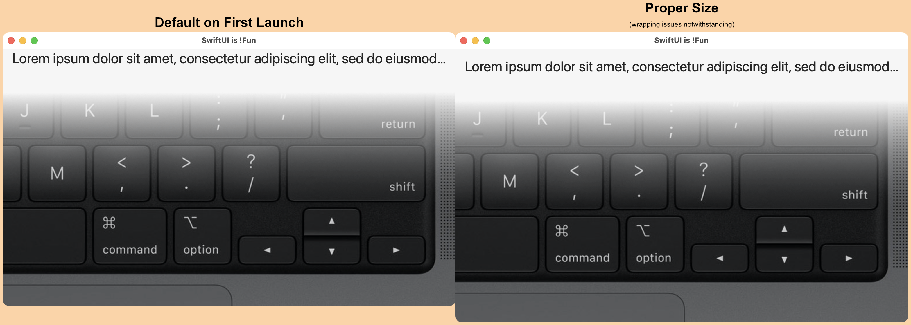

This sample project shows various view sizing issues with a simple SwiftUI view.

## Desired

* The containing window should be fixed to encompass the contents as tightly
	as possible.
* The width should be the width of the image, always.
* The height should grow as necessary (up to the available screen height)
	to accommodate the contents.

## Actual

* The window can be resized horizontally because the text is wider than the
	containing view.
* It can be resized vertically because some of the vertical padding is not
	respected by the `.windowResizability(.contentSize)` modifier.
* The only way I can get the text to properly wrap is to use `.fixedSize(horizontal: false, vertical: true)`,
	which causes it to blow up the vertical spacing.

## Initial Window Size

## Adding `.fixedSize()`

